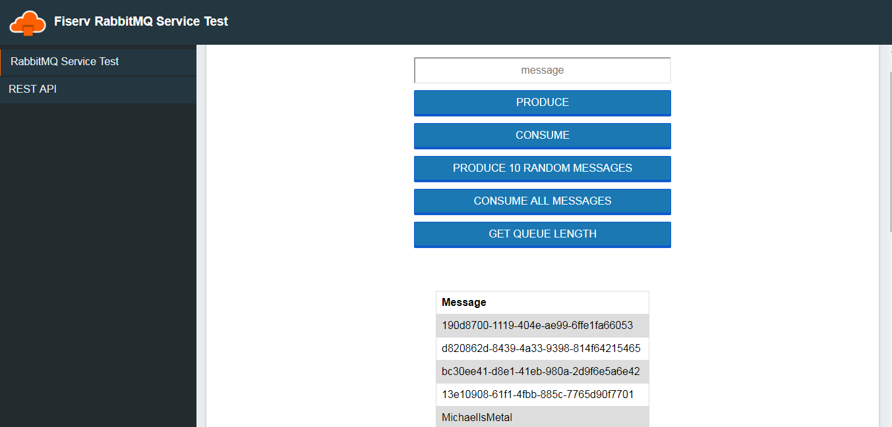

# PCFRabbitMQ
## A PCF app that interacts with some very basic Rabbit producers and consumers
### Problem:
We would find that individuals who use our private cloud often make the claim that a service is improperly implemented. Sometimes we would find the service broken, sometimes the code.
### Solution:
This simple GUI test app is easy enough for even non-technical people to prove out a platform provided service
### Caveats:
Not inteded for performance testing. These test apps only are remedial at best and implemented only with the most basic features
### Features:
* Produce a custom message
* Consume a single message
* Prodcue random messages
* Consume all messages
* Get queue length
### Examples:
* cURL examples for all features

### Implementation:
Only uses one queue, in fact uses the same queue every time. If you restart the app you will connect to same queue. 
### TODO:
* I cast in src/main/java/com/example/demo/WebController.java in the consume method. That cast really gets under my skin. I am so ashamed.
* Should probobly add a purge endpoint and button
* Right now i am queueuing a POJO that is only a string. Possibly allow more complex objects? 

